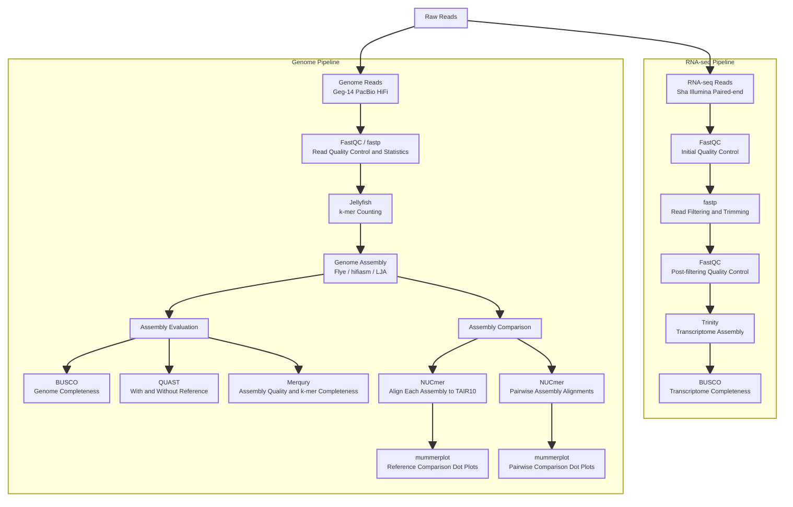

#### **Project Description**
This project assembles the Arabidopsis thaliana Geg-14 genome from PacBio HiFi long reads using Flye, hifiasm and LJA, including an LJA diploid-mode run. It also assembles the Sha transcriptome from Illumina paired-end RNA-seq reads using Trinity. The workflow covers read quality control, k-mer counting and genome size estimation, de novo assembly, and assembly evaluation using BUSCO, QUAST and Merqury. Genome assemblies are compared with the TAIR10 reference and with each other using NUCmer and mummerplot. Jobs are submitted through Slurm, with software run through Apptainer containers or environment modules.
#### **Analysis Pipeline**


The genome branch shows the analysis order; Flye, hifiasm, and LJA use the original raw HiFi reads as assembly input. LJA also has a separate diploid-mode run, described below.

#### **Project Structure**

```
assembly_annotation_course/
├── raw_data/
│   ├── Geg-14/                       # PacBio HiFi genomic reads (ERR11437349)
│   ├── RNAseq_Sha/                   # Paired-end RNA-seq reads (ERR754081)
│   └── references/                   # TAIR10 reference genome and GFF3 annotation
├── read_QC/
│   ├── fastqc/                       # Initial FastQC reports
│   ├── fastp/                        # Processed reads and fastp reports
│   ├── fastqc_clean/                 # FastQC reports for processed reads
│   └── count_kmer/                   # Jellyfish k-mer counts and histogram
├── assembly/
│   ├── flye/                         # Flye genome assembly
│   ├── hifiasm/                      # hifiasm assembly graphs and primary-contig FASTA
│   ├── LJA/                          # LJA genome assembly
│   ├── LJA_di/                       # LJA assembly with --diploid
│   ├── trinity/                      # Trinity intermediate files and logs
│   ├── trinity.Trinity.fasta          # Final transcriptome assembly
│   └── trinity.Trinity.fasta.gene_trans_map  # Gene-to-transcript mapping
├── assembly_evaluation/
│   ├── busco/                        # BUSCO completeness reports and run outputs
│   ├── quast/
│   │   ├── with_reference/           # QUAST evaluation with TAIR10 and annotation
│   │   └── without_reference/        # QUAST evaluation without a reference
│   └── merqury/                      # meryl database and Merqury evaluation outputs
├── comparing/
│   ├── flye/                         # TAIR10 versus Flye alignments and plots
│   ├── hifiasm/                      # TAIR10 versus hifiasm alignments and plots
│   ├── LJA/                          # TAIR10 versus LJA alignments and plots
│   ├── flye_vs_hifiasm/               # Pairwise assembly alignments and plots
│   ├── hifiasm_vs_LJA/                # Pairwise assembly alignments and plots
│   └── flye_vs_LJA/                   # Pairwise assembly alignments and plots
├── scripts/
│   ├── 01_download_reads.sh          # Download sequencing reads
│   ├── 02_run_fastqc.sh              # Initial read quality control
│   ├── 03_trim_reads.sh              # HiFi statistics and RNA-seq filtering with fastp
│   ├── 04_fastqc_clean.sh            # Quality control of processed reads
│   ├── 05_count_kmer.sh              # Jellyfish k-mer counting and histogram generation
│   ├── 06_run_flye.sh                # Genome assembly with Flye
│   ├── 07_run_hifiasm.sh             # Genome assembly with hifiasm and FASTA extraction
│   ├── 08_run_LJA.sh                 # Genome assembly with LJA
│   ├── 08_run_LJA_di.sh              # Genome assembly with LJA in diploid mode
│   ├── 09_run_trinity.sh             # RNA-seq assembly with Trinity
│   ├── 10_run_busco_genome.sh        # BUSCO evaluation in genome mode
│   ├── 11_run_busco_rna.sh           # BUSCO evaluation in transcriptome mode
│   ├── 12_run_quast_re.sh            # QUAST with reference genome and annotation
│   ├── 13_run_quast.sh               # QUAST without a reference, using estimated genome size
│   ├── 14_run_merqury.sh             # Build a meryl database and run Merqury
│   ├── 15_run_nucmer.sh              # Align genome assemblies to TAIR10
│   ├── 16_run_mummerplot.sh          # Plot reference-versus-assembly alignments
│   ├── 17_run_nucmer_sample.sh       # Align genome assemblies to each other
│   ├── 18_run_mummerplot_sample.sh   # Plot pairwise assembly alignments
│   └── busco_downloads/              # Cached BUSCO datasets and version index
├── result/
│   ├── fastqc/                       # Collected FastQC HTML reports
│   ├── kmer_count/                   # GenomeScope report
│   └── assembly_evaluation/          # Directory for collected evaluation results
|   └── comparison/                   # collected dotplot
└── readme.md                         # This document
```
#### **Prerequisites**

- Working directory: `/data/users/jli/assembly_annotation_course`.
- Environment: Linux cluster with Slurm (`pibu_el8` partition), Apptainer, and environment modules.
- Software used by the existing scripts:

| Tool | Container under `/containers/apptainer/` or module |
| --- | --- |
| FastQC | `fastqc-0.12.1.sif` |
| fastp | `fastp_0.24.1.sif` |
| Jellyfish | `jellyfish-2.2.6--0.sif` |
| Flye | `flye_2.9.5.sif` |
| hifiasm | `hifiasm_0.25.0.sif` |
| LJA | `lja-0.2.sif` |
| Trinity | Module `Trinity/2.15.1-foss-2021a` |
| BUSCO | `busco_5.7.1.sif` |
| QUAST | `quast_5.2.0.sif` |
| Merqury / meryl | `merqury_1.3.sif` |
| NUCmer / mummerplot / gnuplot | `mummer4_gnuplot.sif` |

- Genomic input: Geg-14 PacBio HiFi reads, `raw_data/Geg-14/ERR11437349.fastq.gz`.
- RNA-seq input: Sha paired-end reads, `raw_data/RNAseq_Sha/ERR754081_1.fastq.gz` and `ERR754081_2.fastq.gz`.
- Reference files already present in `raw_data/references/`:
  - `Arabidopsis_thaliana.TAIR10.dna.toplevel.fa.gz`: compressed reference used by QUAST.
  - `Arabidopsis_thaliana.TAIR10.dna.toplevel.fa`: uncompressed reference used by NUCmer and mummerplot.
  - `Arabidopsis_thaliana.TAIR10.57.gff3`: annotation used by QUAST.
  

#### **Step-by-Step Execution**

The steps below follow the existing script numbers. Run commands from the project root; the scripts use absolute paths to this workspace. Wait for each required input-producing job to finish successfully before submitting its dependent jobs. Genome assemblers can run independently once the raw HiFi reads are available; Trinity requires the filtered RNA-seq reads.


#### **Read Preparation and Quality Control — Scripts 01–05**

**Step 01: Prepare genome and RNA-seq reads**

<small><strong>Script:</strong></small> `scripts/01_download_reads.sh`

The script copies the Geg-14 and RNAseq_Sha directories from `/data/courses/assembly-annotation-course/raw_data/` into this workspace. 

<small><strong>Output:</strong></small>

```text
raw_data/
├── Geg-14/ERR11437349.fastq.gz
└── RNAseq_Sha/
    ├── ERR754081_1.fastq.gz
    └── ERR754081_2.fastq.gz
```

**Step 02: Initial FastQC for genome and RNA-seq reads**

<small><strong>Script:</strong></small> `scripts/02_run_fastqc.sh`

Runs FastQC with two threads on both the raw Geg-14 HiFi reads and the two Sha RNA-seq files.

<small><strong>Output:</strong></small> HTML and ZIP reports in `read_QC/fastqc/`, with prefixes `ERR11437349_fastqc`, `ERR754081_1_fastqc`, and `ERR754081_2_fastqc`.

**Step 03: HiFi statistics and RNA-seq filtering with fastp**

<small><strong>Script:</strong></small> `scripts/03_trim_reads.sh`

<small><strong>Genome branch:</strong></small> `-Q -L -A -G` disables quality filtering, length filtering, adapter trimming, and poly-G trimming. The HiFi output is used for statistics and k-mer counting. Genome assembly scripts subsequently use the original raw HiFi file.

<small><strong>RNA-seq branch:</strong></small> filters the paired-end reads with the following parameters:

| Parameter | Setting in the script |
| --- | --- |
| Adapter detection | `--detect_adapter_for_pe` |
| Tail trimming | `--cut_tail --cut_tail_window_size 4 --cut_tail_mean_quality 20` |
| Qualified-base quality threshold | `-q 20` |
| Maximum percentage of unqualified bases | `-u 30` |
| Maximum ambiguous bases per read | `-n 5` |
| Minimum read length | `-l 50` |

<small><strong>Output:</strong></small>

```text
read_QC/fastp/
├── ERR11437349_clean.fastq.gz
├── Geg-14.fastp.html
├── Geg-14.fastp.json
├── ERR754081_1_clean.fastq.gz
├── ERR754081_2_clean.fastq.gz
├── RNAseq_Sha.fastp.html
└── RNAseq_Sha.fastp.json
```

**Step 04: FastQC of filtered RNA-seq reads**

<small><strong>Script:</strong></small> `scripts/04_fastqc_clean.sh`

Runs FastQC with two threads on `ERR754081*_clean.fastq.gz`. This script rechecks only the RNA-seq reads.

<small><strong>Output:</strong></small>

```text
read_QC/fastqc_clean/
├── ERR754081_1_clean_fastqc.html
├── ERR754081_1_clean_fastqc.zip
├── ERR754081_2_clean_fastqc.html
└── ERR754081_2_clean_fastqc.zip
```

**Step 05: HiFi k-mer counting and genome size estimation**

<small><strong>Script:</strong></small> `scripts/05_count_kmer.sh`

Counts canonical 21-mers in `read_QC/fastp/ERR11437349_clean.fastq.gz` with Jellyfish (`-C -m 21 -s 5G -t 4`), then generates a histogram.

<small><strong>Output:</strong></small>

```text
read_QC/count_kmer/
├── Geg-14.jf
└── Geg-14.histo
```

GenomeScope analysis is a separate step using the histogram. Upload the Geg-14.histo to http://genomescope.org/genomescope2.0/ to generate the GenomeScope k-mer profile analysis report. This report is already present at `result/kmer_count/GenomeScope.pdf`. Scripts 13 and 14 currently use the fixed genome size value `158360844` bp.

#### **Genome and Transcriptome Assembly — Scripts 06–09**

All three genome assemblers runs below use `raw_data/Geg-14/ERR11437349.fastq.gz`. The RNA assembler runs below use `read_QC/fastp/ERR754081_1_clean.fastq.gz` and `read_QC/fastp/ERR754081_2_clean.fastq.gz`

**Step 06: Genome assembly with Flye**

<small><strong>Script:</strong></small> `scripts/06_run_flye.sh`

<small><strong>Parameters:</strong></small> `--pacbio-hifi`, `--threads 16`.

<small><strong>Output:</strong></small> `assembly/flye/assembly.fasta`, `assembly_graph.gfa`, `assembly_graph.gv`, `assembly_info.txt`, and `flye.log`.

**Step 07: Genome assembly with hifiasm**

<small><strong>Script:</strong></small> `scripts/07_run_hifiasm.sh`

<small><strong>Parameters:</strong></small> `-t 16`, output prefix `assembly/hifiasm/ERR11437349.asm`.

The script extracts sequence records from the primary-contig GFA with `awk` to create `assembly/hifiasm/assembly.fasta` for downstream evaluation and comparison.

<small><strong>Output:</strong></small> `assembly/hifiasm/ERR11437349.asm.bp.p_ctg.gfa`, additional assembly graphs and binary files, and `assembly/hifiasm/assembly.fasta`.

**Step 08: Genome assembly with LJA**

<small><strong>Script:</strong></small> `scripts/08_run_LJA.sh`

<small><strong>Parameters:</strong></small> `--reads` with raw HiFi input, `-t 16`.

<small><strong>Output:</strong></small> `assembly/LJA/assembly.fasta`, `mdbg.gfa`, and `dbg.log`.

**Step 08 (diploid): Genome assembly with LJA diploid mode**

<small><strong>Script:</strong></small> `scripts/08_run_LJA_di.sh`

<small><strong>Parameters:</strong></small> `--diploid --reads` with raw HiFi input, `-t 16`.

<small><strong>Output:</strong></small> `assembly/LJA_di/assembly.fasta`, `mdbg.gfa`, and `dbg.log`.

**Step 09: RNA-seq transcriptome assembly with Trinity**

<small><strong>Script:</strong></small> `scripts/09_run_trinity.sh`

<small><strong>Input:</strong></small> `read_QC/fastp/ERR754081_1_clean.fastq.gz` and `ERR754081_2_clean.fastq.gz`, selected by the script's left/right wildcards.

<small><strong>Parameters:</strong></small> `--seqType fq --max_memory 50G --CPU 10`

<small><strong>Output:</strong></small>

```text
assembly/
├── trinity/                              # Intermediate files and Slurm logs
├── trinity.Trinity.fasta                 # Final assembled transcripts
└── trinity.Trinity.fasta.gene_trans_map   # Gene-to-transcript mapping
```

#### **Assembly Evaluation — Scripts 10–14**

**Step 10: Genome completeness evaluation with BUSCO**

<small><strong>Script:</strong></small> `scripts/10_run_busco_genome.sh`

The first positional argument selects both the assembly directory and the BUSCO output name. Submit a separate job for each genome assembly:

```bash
sbatch ./scripts/10_run_busco_genome.sh flye
sbatch ./scripts/10_run_busco_genome.sh hifiasm
sbatch ./scripts/10_run_busco_genome.sh LJA
sbatch ./scripts/10_run_busco_genome.sh LJA_di
```

<small><strong>Parameters:</strong></small> `-m genome -l brassicales_odb10 -c 16`.

<small><strong>Output:</strong></small> `assembly_evaluation/busco/<assembler_name>/`, including text/JSON short summaries and `run_brassicales_odb10/full_table.tsv`. Review complete single-copy, complete duplicated, fragmented, and missing BUSCOs. Results for all three genome assemblers are present in the workspace.

**Step 11: Transcriptome completeness evaluation with BUSCO**

<small><strong>Script:</strong></small> `scripts/11_run_busco_rna.sh`

<small><strong>Parameters:</strong></small> `-m transcriptome -l brassicales_odb10 -c 16`.

<small><strong>Output:</strong></small>

```text
assembly_evaluation/busco/trinity/
├── short_summary.specific.brassicales_odb10.trinity.txt
├── short_summary.specific.brassicales_odb10.trinity.json
├── logs/
└── run_brassicales_odb10/
    └── full_table.tsv
```


**Step 12: QUAST evaluation with the TAIR10 reference**

<small><strong>Script:</strong></small> `scripts/12_run_quast_re.sh`

Evaluates Flye, hifiasm, LJA, and LJA_di together against the Arabidopsis_thaliana.TAIR10 reference and annotation.

<small><strong>Parameters:</strong></small> `-t 10 -e --large --labels "flye,hifiasm,LJA,LJA_di"`.

<small><strong>Output:</strong></small> `assembly_evaluation/quast/with_reference/`, including `report.html`, `report.tsv`, `report.txt`, `report.pdf`, `icarus.html`, and `quast.log`. Review assembly size, contiguity, reference coverage, and misassembly statistics. Reports are already present in this directory.

**Step 13: QUAST evaluation without a reference**

<small><strong>Script:</strong></small> `scripts/13_run_quast.sh`

<small><strong>Parameters:</strong></small> `-t 10 -e --large --est-ref-size 158360844`, with the same four assembly labels.

<small><strong>Output:</strong></small> reports under `assembly_evaluation/quast/without_reference/`, including `report.html`, `report.tsv`, and `report.txt`. Use these reports for reference-independent contiguity and length statistics. The output directory exists in the workspace, but the report files listed above are not currently present.

**Step 14: k-mer-based assembly evaluation with Merqury**

<small><strong>Script:</strong></small> `scripts/14_run_merqury.sh`

<small><strong>Workflow:</strong></small>

1. Call `best_k.sh 158360844 0.001` and round its result up to an integer k-mer size.
2. Build `assembly_evaluation/merqury/Geg14_HiFi.meryl` from the raw Geg-14 HiFi reads with `meryl`, using 16 threads.
3. Run Merqury in separate output directories for the assembly evaluations.

<small><strong>Output:</strong></small>

```text
assembly_evaluation/merqury/
├── Geg14_HiFi.meryl/
├── flye/       # Prefix: flye_merqury
├── hifiasm/    # Prefix: hifiasm_merqury
├── LJA/        # Prefix: LJA_merqury
└── LJA_di/     # Prefix: LJA_di_merqury
```

Each run produces QV files (`*.qv`), k-mer completeness statistics (`*.completeness.stats`), and spectra plots (`*.spectra-asm.*.png`, `*.assembly.spectra-cn.*.png`). These output directories and files are present.


#### **Genome Assembly Comparison — Scripts 15–18**

The existing comparison scripts include Flye, hifiasm, and LJA. 

**Step 15: Align genome assemblies to TAIR10 with NUCmer**

<small><strong>Script:</strong></small> `scripts/15_run_nucmer.sh`

<small><strong>Input:</strong></small> the uncompressed `raw_data/references/*.fa` as the reference and each of the three genome assemblies as the query. Each `nucmer -p` call sets a separate output prefix.

<small><strong>Output:</strong></small>

```text
comparing/
├── flye/ref_vs_flye.delta
├── hifiasm/ref_vs_hifiasm.delta
└── LJA/ref_vs_LJA.delta
```

**Step 16: Plot reference-versus-assembly alignments**

<small><strong>Script:</strong></small> `scripts/16_run_mummerplot.sh`

Run after Step 15 completes successfully:

<small><strong>Input:</strong></small> the three reference alignment `.delta` files, the TAIR10 FASTA, and the corresponding assembly FASTA files.

<small><strong>Parameters:</strong></small> `-t png --filter --large --layout --fat`.

<small><strong>Output:</strong></small>

```text
comparing/
├── flye/ref_vs_flye_plot.png
├── hifiasm/ref_vs_hifiasm_plot.png
└── LJA/ref_vs_LJA_plot.png
```

**Step 17: Pairwise genome assembly alignments with NUCmer**

<small><strong>Script:</strong></small> `scripts/17_run_nucmer_sample.sh`

<small><strong>Comparison pairs:</strong></small>

| Output directory | Reference assembly | Query assembly |
| --- | --- | --- |
| `flye_vs_hifiasm` | Flye | hifiasm |
| `hifiasm_vs_LJA` | hifiasm | LJA |
| `flye_vs_LJA` | Flye | LJA |

<small><strong>Output:</strong></small>

```text
comparing/
├── flye_vs_hifiasm/flye_vs_hifiasm.delta
├── hifiasm_vs_LJA/hifiasm_vs_LJA.delta
└── flye_vs_LJA/flye_vs_LJA.delta
```

**Step 18: Plot pairwise genome assembly alignments**

<small><strong>Script:</strong></small> `scripts/18_run_mummerplot_sample.sh`

Run after Step 17 completes successfully:

<small><strong>Input:</strong></small> the three pairwise `.delta` files and their corresponding reference/query assembly FASTA files.

<small><strong>Parameters:</strong></small> `-t png --filter --large --layout --fat`.

<small><strong>Output:</strong></small>

```text
comparing/
├── flye_vs_hifiasm/flye_vs_hifiasm_plot.png
├── hifiasm_vs_LJA/hifiasm_vs_LJA_plot.png
└── flye_vs_LJA/flye_vs_LJA_plot.png
```

Use the dot plots to inspect assembly correspondence and structural differences. 

#### **Contact**

For questions or issues regarding this analysis, please contact:
jiajing.li@students.unibe.ch
